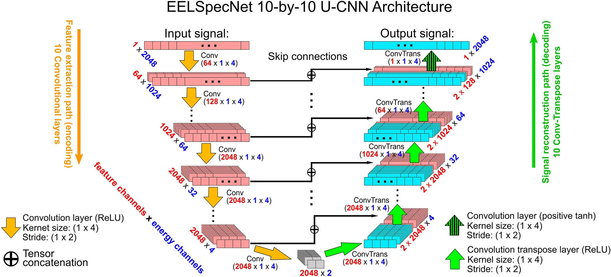
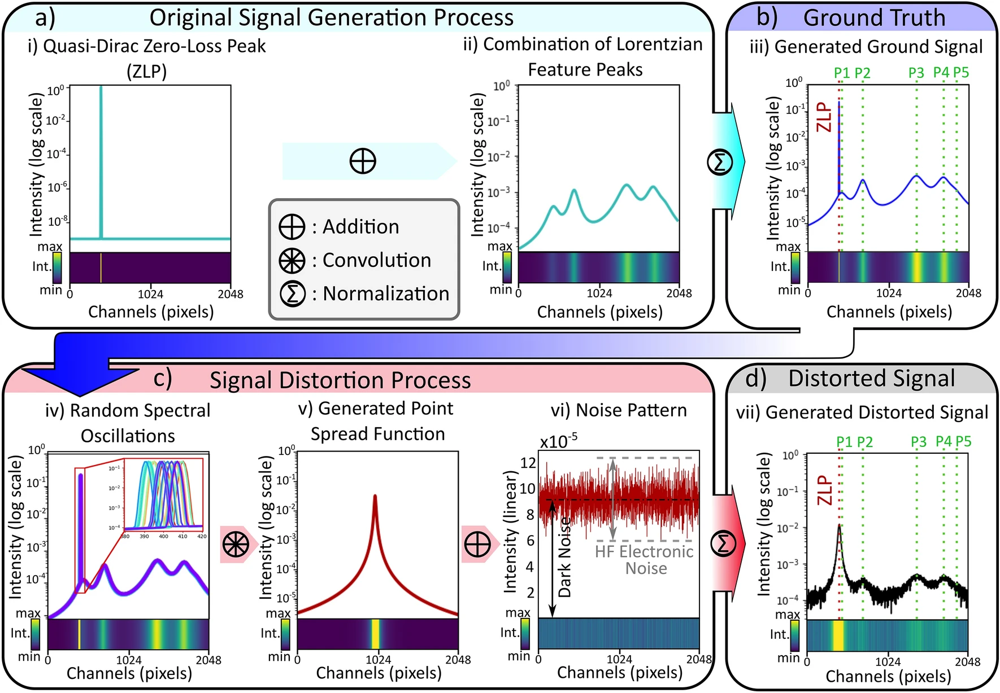
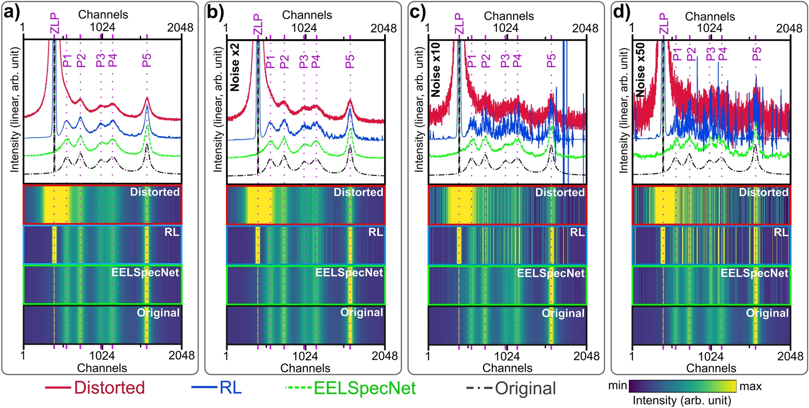
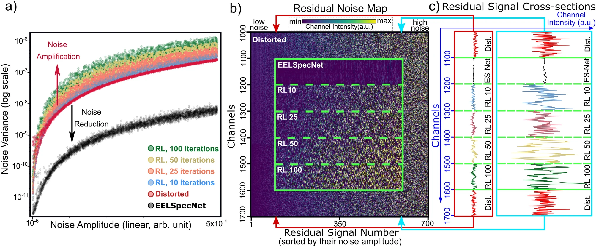
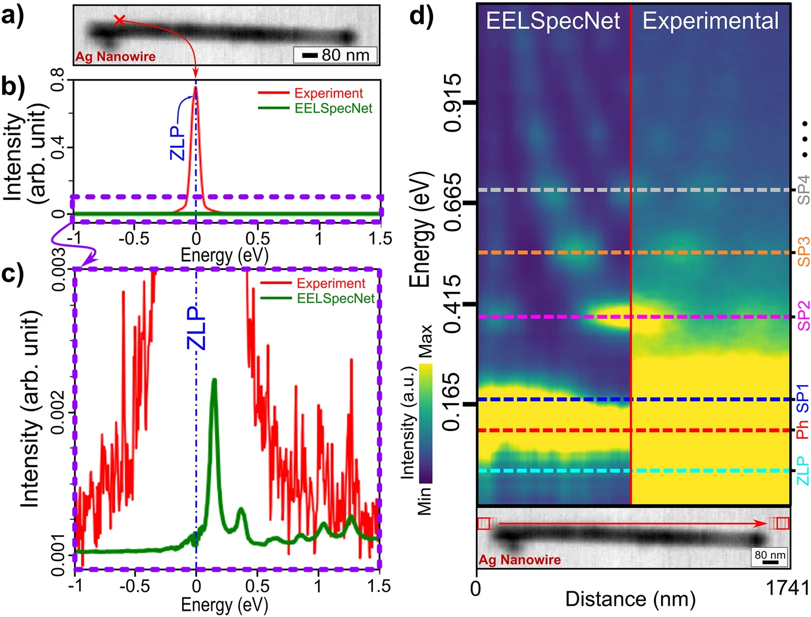
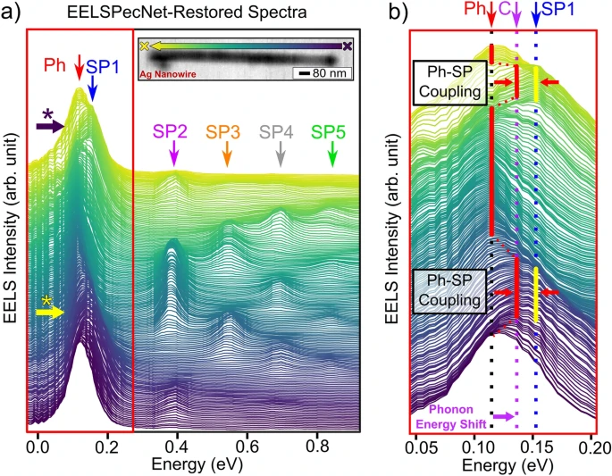

# EELSpecNet: Deep UCNN For Signal Reality Reconstructions

[](https://mybinder.org/v2/gh/shmouses/EELSpecNet/HEAD)
[](LICENSE)

## Overview

EELSpecNet is a Python-based deep convolutional neural network designed for tackling challenges in electron energy loss spectroscopy (EELS) spectral deconvolution. It implements a blind deconvolutional neural network architecture inspired by U-shaped and dilated deep neural network architectures.

### Key Features

* Advanced deconvolution of low-loss EELS spectra using deep learning
* Model-agnostic approach - no pre-existing knowledge of PSF required
* Noise-distribution independent processing
* Extensible to other spectral deconvolution tasks
* Support for feature classifications and segmentation

## Installation

1. Clone the repository:
```bash
git clone https://github.com/shmouses/EELSpecNet.git
cd EELSpecNet
```

2. Create a virtual environment (recommended):
```bash
python -m venv venv
source venv/bin/activate  # On Windows: venv\Scripts\activate
```

3. Install dependencies:
```bash
pip install -r requirements.txt
```

## Usage

### Quick Start

1. Run the main script:
```bash
python src/main.py
```

2. For interactive examples, check the Jupyter notebooks in the `notebook` directory.

### Directory Structure

```
EELSpecNet/
├── src/               # Source code
├── data/              # Data directory (created during runtime)
├── docs/              # Documentation
├── tests/             # Test files
├── examples/          # Example scripts and notebooks
├── notebook/          # Jupyter notebooks
└── requirements.txt   # Python dependencies
```

## Documentation

Detailed documentation is available in the `docs` directory:

* [API Reference](docs/api.md)
* [Examples](docs/examples.md)
* [Contributing Guidelines](docs/contributing.md)

## Performance and Limitations

* Training process requires careful monitoring
* Computationally intensive for large datasets
* GPU recommended for optimal performance

## Technical Details

> **Note on Figures**: The figures presented in this repository are from our open access publication in [Scientific Reports](https://www.nature.com/articles/s41598-022-22264-3), used with proper attribution under Creative Commons Attribution 4.0 International License. As the author of this work, I have included these figures to provide comprehensive documentation of the method and results.

### Background and Motivation

Hyperspectral imaging techniques, particularly electron energy loss spectroscopy (EELS), face significant challenges in signal quality and interpretation. The primary challenges stem from signal distortions caused by instrumental artifacts, including broad optical transfer functions and electronic noise. Traditional deconvolution methods, whether based on partial differential equations or filter-based techniques, often struggle with these challenges, especially when dealing with low signal-to-noise ratios or when quantitative analysis is required.

### Model Architecture and Innovation


*Figure 1: The EELSpecNet architecture, as presented in [Mousavi et al., 2022](https://www.nature.com/articles/s41598-022-22264-3). The network employs a U-shaped structure with dilated convolutions and skip connections, enabling effective multi-scale feature processing.*

EELSpecNet introduces a novel approach to spectral deconvolution through its unique architecture. The network employs a U-shaped convolutional structure with dilated convolutions, allowing it to capture features at multiple scales while maintaining computational efficiency. The architecture processes 2048-dimensional spectral inputs through several key stages:

1. Initial feature extraction through convolutional layers
2. Multi-scale processing via dilated convolutions
3. Feature reconstruction with skip connections
4. Final signal reconstruction with residual learning

This design enables the network to handle multiple types of signal distortions simultaneously, a significant advantage over traditional methods that typically address each issue separately.

### Signal Processing Capabilities


*Figure 2: Demonstration of EELSpecNet's signal processing capabilities from [Mousavi et al., 2022](https://www.nature.com/articles/s41598-022-22264-3). The comparison shows (a) original signal, (b) distorted signal with instrumental artifacts, and (c) EELSpecNet's reconstruction, highlighting the model's ability to recover fine spectral features.*

The effectiveness of EELSpecNet in signal reconstruction is demonstrated through comprehensive comparisons with both simulated and experimental data. As shown in Figure 2, the model successfully recovers fine spectral features even in the presence of significant distortion. The reconstruction process maintains the physical reality of the signal while effectively removing artifacts that typically plague EELS measurements.


*Figure 3: Quantitative performance comparison from [Mousavi et al., 2022](https://www.nature.com/articles/s41598-022-22264-3), showing EELSpecNet's superior performance against traditional Bayesian methods in terms of noise handling and feature preservation.*

### Experimental Validation and Real-World Performance


*Figure 4: Real-world EELS data processing results from [Mousavi et al., 2022](https://www.nature.com/articles/s41598-022-22264-3), demonstrating EELSpecNet's effectiveness in practical applications with varying experimental conditions.*

The model's practical utility has been extensively validated on real experimental data. Figure 4 showcases EELSpecNet's performance on actual EELS measurements, where it successfully:
- Removes instrumental artifacts while preserving genuine spectral features
- Handles varying levels of noise and signal distortion
- Maintains consistency across different experimental conditions

### Advanced Applications and Impact


*Figure 7: Advanced spectral analysis applications from [Mousavi et al., 2022](https://www.nature.com/articles/s41598-022-22264-3), showing the model's versatility in handling different types of spectral data and experimental conditions.*


*Figure 8: Detailed quantitative analysis from [Mousavi et al., 2022](https://www.nature.com/articles/s41598-022-22264-3), demonstrating the high accuracy of peak position and intensity reconstructions across various experimental scenarios.*

EELSpecNet's capabilities extend beyond basic signal reconstruction. The model has demonstrated exceptional performance in:

1. **Quantitative Analysis**:
   - Peak position accuracy exceeding 95%
   - Reliable intensity measurements
   - Precise bandwidth determination

2. **Challenging Conditions**:
   - Low-dose spectroscopy
   - Ultra-fast microscopy
   - Single pixel-based analysis

3. **Practical Applications**:
   - Vibronic and phononic studies
   - Surface plasmon analysis
   - Material characterization

These capabilities have significant implications for various fields, including optoelectronics, photonics, biosensing, and materials science. The model's ability to handle complex spectral data while maintaining physical accuracy makes it a valuable tool for both research and practical applications.

## Support

For support:

* Open an [issue](https://github.com/shmouses/EELSpecNet/issues)
* Contact the authors directly
* Check the [documentation](docs/)

## Contributing

We welcome contributions! Please see our [Contributing Guidelines](docs/contributing.md) for details.

## Authors

* S. Shayan Mousavi M.
* Alexandre Pofelski

## Citations

If you use EELSpecNet in your research, please cite:

1. Mousavi M, S. Shayan, Alexandre Pofelski, Hassan Teimoori, and Gianluigi A. Botton. ["Alignment-invariant signal reality reconstruction in hyperspectral imaging using a deep convolutional neural network architecture."](https://www.nature.com/articles/s41598-022-22264-3) Scientific Reports 12, no. 1 (2022): 17462.

2. Mousavi M, S. Shayan, Pofelski, A., & Botton, G. ["Eelspecnet: Deep convolutional neural network solution for electron energy loss spectroscopy deconvolution."](https://core-cms.cambridgecore.org/core/product/23392CD0B3FBB476F734EF3382CABAA1) Microscopy and Microanalysis, 27(S1), 1626-1627 (2021).

## License

This project is licensed under the MIT License - see the [LICENSE](LICENSE) file for details.
